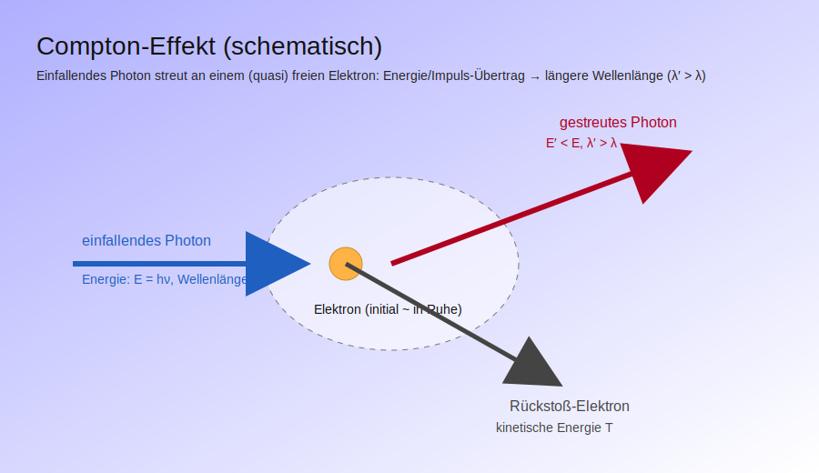
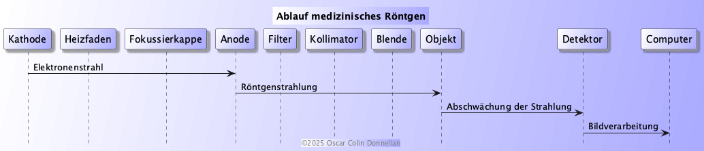
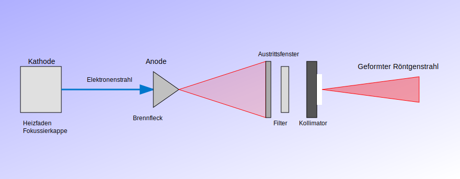

= GFS Röntgenstrahlen
:toc: right
:data-uri:

====
*LEITFRAGE:* Wie interagiert Röntgenstrahlung mit Materie
====

== Einordnung

* ionisierend (kann Atome oder Moleküle ionisieren) 
(<<gloss-ionisieren,Definition Ionisieren>>)
* ähnelt Gammastrahlung aber energieärmer
* hohes Durchdringungsvermögen
* kann weder durch elektrische noch magnetische Kräfte abgelenkt werden (elektromagnetisch)

== Entdeckung
* 8. November 1895
* Conrad Wilhelm Röntgen
* kein Patent (wollte schnell einsetzbar machen)
* bei Forschung zu elektrischen Entladungen in verdünnten Gasen
* 22. Dezember 1895 Röntgenaufnahme Hand seiner Frau
* 23. Januar 1896 Entdeckung vorgestellt
* Röntgen sprach von X-Strahlung, bedeutet „unbekannte Strahlen“ => Englisch: X-Rays
* 1901 Nobelpreis für Physik

== Unterschied Röntgen und MRT
. Röntgen: elektromagnetische Strahlung mit sehr kurzer Wellenlänge (hohe Energie) durchdringt weiche Gewebe größtenteils, dichte Strukturen absorbieren Strahlung dadurch entsteht ein Bild auf dem hintergelegten Detektor das verschiedene Graustufen je nach durchgelassener Strahlenmenge zeigt (dichte Strukturen lassen weniger Strahlen durch => heller auf Bilddetektor)
image:BspRöntgen.png[]
.. CT: viele Röntgenbilder aus verschiedenen Winkeln aufgenommen um ein 3D-Bild zu bilden
. MRT: nutzt Magnetfelder und Radiowellen, keine ionisierende Strahlung, zeigt weiche Strukturen und Unterschiede zwischen ihnen besser (=>Bänderrisse erkennbar), Atome im Körper richten sich im Magnetfeld anders aus => wenn wieder ausgeschaltet werden senden sie Radiowellen aus, die durch hochempflindliche Geräte gemessen werden können => darauf basierend erstellt ein Computer ein Bild

== Compton-Effekt 
* Der Compton-Effekt erzeugt innerhalb von der Röntgenaufnahme Rauschen wodurch die Bildqualität verschlechtert wird
* Funktioniert durch Streuung von Photon an fast freien Elektronen => Ablenkung und Streuung auf Bilddetektor problematisch da unklare Informationen überbracht werden
(<<gloss-compton-effekt,Definition Compton-Effekt>>)

.Compton-Effekt Bild

 

== Funktionsweise 
* Röntgenstrahlen werden von weichen Geweben größtenteils durchgelassen (Muskel,Haut,Organe)
* dichte strukturen (knochen, tumor) lassen nicht durch => Bilddetektor (meist digital) nimmt auf => durchgelassen/nicht durchgelassen sichtbar
* Röntgen-Bremsstrahlung Energie Elektron wird durch Abbremsung von Atomkern zu EPh (Energie Photon) umgewandelt (=> Röntgenstrahlung entsteht) 
(<<gloss-bremsstrahlung,Definition Bremsstrahlung>>)
* Strahlung entsteht auch durch charakteristische Strahlung (Elektron fällt von äußerer Schale auf innere Schale => Energie wird frei in Form von Röntgenstrahlung)
(<<gloss-chara-strah,Definition Charakteristische Strahlung>>)
* In der Medizin und Technik beide für Erzeugung genutzt
* Röntgen muss gefiltert, fokussiert und gebündelt werden um sicher genutzt zu werden
* Röntgen kann nicht klassisch reflektiert werden und muss die fast perfekt glatte Oberfläche (glatte,massereiche Metalle) so gut wie flach treffen (Winkel<1 Grad) um reflektiert zu werden
* normale Linsen funktionieren für Röntgen nicht, da Röntgen sie einfach durchdringt
* Filterung ist nötig um die richtigen Strahlen zu erhalten (zb nur hochenergetische Strahlen für CT)
* oft werden die Strahlen gebündelt und kollimiert (durch Bleiblende) um Streustrahlung zu vermeiden
* Um die Strahlung innerhalb der Maschine zu erzeugen hitzt eine Kathode (negativ geladen) auf und Elektronen werden emittiert und treffen auf eine Anode (positiv geladen) => durch Abbremsung entsteht Röntgenstrahlung
(<<gloss-bremsstrahlung,Definition Bremsstrahlung>>)
* In Röntgenmaschinen (Projektionsradiographie) wird die Strahlung durch eine Blende auf das zu untersuchende Objekt gerichtet
* dahinter befindet sich der Bilddetektor (früher Film heute digital)
* die Kreation von Linsen für Röntgenstrahlen ist teuer und schwierig (oft mit speziellen Metallen und winzigen Detailstrukturen)

.Röntgen Ablauf

.Röntgen Aufbau

== Anwendung Medizin
. diagnostisch:
* Projektionsradiographie (klassisches Röntgen, Bilddetektor hinter Objekt=Röntgen “projeziert” ein Graustufenbild auf Detektor/Film), Computertomografie (wie 3d röntgen (+kann auch Bewegung zeigen)) im Gegensatz zu normalem Röntgen werden hier viele Röntgenbilder aus verschiedenen Winkeln aufgenommen und zu einem 3D-Bild zusammengesetzt (erstmals eingesetzt in 1974)
* CT kann Querschnittsbilder des Körpers erstellen (durch verschiedene Winkel)
* erstellt 2d bild von struktur
* bei Knochenbrüchen, Zahnmedizin, Tumordiagnostik effektiv aber für weiche Gewebestrukturen (Bänderrisse, Organschäden) eher ungeeignet (MRT wird benutzt)
. therapeutisch:
* Tumoren kontrollieren oder zerstören (Strahlentherapie) (funktioniert durch gezielte Zerstörung von zb Krebszellen oder Tumoren, sehr wichtig zu fokussieren um gesunde Zellen nicht anzugreifen)
* Strahlenquelle rotiert um Patient um Tumor zu treffen aber gesundes Gewebe zu schonen
* oft kombiniert mit Chemotherapie
(<<gloss-chemotherapie,Definition Chemotherapie>>)
(<<gloss-querschnitt,Definition Querschnittbild>>)

== Risiken Medizin
* Schäden in einzelnen Zellen oder Geweben (kommt auf Strahlenmenge an) => daher Strahlenschutzmaßnahmen wie Bleischürzen an Intimbereich oder bei Zahnarzt auch Bleischutzkragen für Schilddrüse 
* kann Erbgut schädigen => durch Ionisierung
* erhöhtes Krebsrisiko durch Zellschädigung und DNA-Veränderungen
* empfohlen geringe Strahlenmenge zu verwenden (ALARA-Prinzip: As Low As Reasonably Achievable) 
* Nutzen-Risiko-Abwägung (Nutzen der Untersuchung muss höher sein als Risiko durch Strahlenbelastung)

== Anwendung Technik
* Sicherheits- und Kontrolltechnik (Flughafen Handgepäckkontrolle nach LuftSiG)
* teilweise für Personenkontrolle
* Materialanalyse, zerstörungsfreie Werkstoffprüfung (Schäden in Bauteilen sichtbar machen ohne sie zu zerstören oder zu zerschneiden) 
* Röntgenfluorenzanalyse (RFA/XRF)
    ** eine Methode um die durch primäre Röntgenstrahlung dazu anzuregen von sich Fluoreszenzröntgenstrahlung abzugeben und somit die Zusammensetzung der Materialprobe zu bestimmen
* Röntgendiffraktometrie (RDA/XRD)
    ** eine Methode zur Untersuchung von Kristallstrukturen durch Beugung von Röntgenstrahlen an den Kristallen (da Abstände in Kristallen im Bereich der Wellenlänge von Röntgenstrahlen liegen) dafür benötigt man monochromatische Röntgenstrahlung (Röntgenstrahlung mit nur einer Wellenlänge) diese wird durch Filterung mit Einkristallen oder mit Hilfe von Metallfolien erzeugt.

(<<gloss-einkristall,Definition Einkristall>>)
(<<gloss-monochromatisch,Definition monochromatische Röntgenstrahlung>>)

== Alltag
. Einfache Bespiele
* Strahlung ist im Alltag so gut wie überall (Atmosphäre hält die Strahlung vom Universum weg von der Erde sonst kein Leben auf Erde möglich) (kosmische Hintergrund- , Sonnen-, Röntgen-, etc.)
* Kosmische Hintergrundstrahlung (Überrest des Urknalls)
* Beim Arzt und Zahnarzt
* Am Flughafen
. Exotische Beispiele
* Rauchmelder (amerikanische Modelle enthalten oft Americium-241, ein radioaktiver Stoff)
* Paketband von Glasfläche abziehen (Röntgenstrahlung wenig aber energiereich) (sehr gut in Vakuum)
* Röntgen um Sprengstoff zu entdecken (großer Scanner für Fahrzeuge in Kriegsgebieten)
(<<gloss-kosmi-hintergru,Definition kosmische Hintergrundstrahlung>>)

== Antwort Leitfrage
Röntgenstrahlen interagieren für die klassische Projektionsradiographie mit Materie durch Durchdringung und Absorption (je nach Dichte des Materials unterschiedlich stark) um Bilder zu erzeugen jedoch gibt es auch andere Wirkungen wie die Anregung von Atomen zur Abgabe von Licht (Röntgenfluoreszenzanalyse) oder die Beugung an Kristallen (Röntgendiffraktometrie) um Materialeigenschaften zu untersuchen. 
Außerdem können Röntgenstrahlen durch Ionisation von Atomen und Molekülen in Materie Schäden verursachen was sowohl gutes wie auch schlechtes mit sich bringt in der Medizin nutzt man dies um Tumore zu zerstören jedoch kann dies auch gesunde Zellen oder die eigene DNA schädigen und somit das Krebsrisiko erhöhen weshalb Strahlenschutzmaßnahmen und eine Nutzen-Risiko-Abwägung wichtig sind.
Auch eine Wechselwirkung ist der Compton-Effekt bei dem Photonen an fast freien Elektronen gestreut werden wodurch sich die Röntgenphotonen ablenken und streuen. 
(<<gloss-compton-effekt,Definition Compton-Effekt>>)

== Glossar
[[gloss-bremsstrahlung]]
Bremsstrahlung:: durch Abbremsung von Elektronen im elektrischen Feld eines Atomkerns entsteht Röntgenstrahlung, da Energie des Elektrons laut Energieerhaltungsgesetz nicht verloren gehn kann, wird sie in Photonenenergie umgewandelt (abgeänderte Definition per Friedrich-Alexander-Universität Erlangen-Nürnberg siehe Quellenangabe)
[[gloss-chara-strah]]
Charakteristische Strahlung:: Charakteristische Strahlung: Befindet sich auf einer inneren Schale im Atom ein freier Platz für eine Elektron, so wird es durch ein Elektron auf einer weiter außen liegenden Schale aufgefüllt, um einen energetisch günstigeren Zustand zu erlangen. Dadurch wird Energie in Form von Strahlung frei. Die Höhe der Strahlungsenergie ist abhängig von der Art des Atoms, von der Schale die aufgefüllt wird und von der Schale aus der das Elektron herabfällt. Da die Atomschalen mit K, L, M, usw. bezeichnet werden, spricht man hier von Kα-, Kβ-, Lα-, Lβ-, usw. Strahlung. (Definition per Technische Hochschule Mittelhessen siehe Quellenangabe)
[[gloss-chemotherapie]]
Chemotherapie:: Bei einer Chemotherapie werden im Rahmen der Behandlung von Krebs bestimmte Medikamente, die Zytostatika, eingesetzt, welche Krebszellen abtöten oder ihre Vermehrung stoppen können. Eine Chemotherapie kann vor (neoadjuvant) oder nach einer Operation (adjuvant), als alleinige Maßnahme oder in Kombination mit anderen Therapieoptionen durchgeführt werden. (Definition per Deutsche Krebshilfe siehe Quellenangabe)
[[gloss-compton-effekt]]
Compton-Effekt:: Der Compton-Effekt ist ein zentrales Beispiel für den Teilchencharakter des Lichts. Dabei werden Photonen im Röntgenenergiebereich an fast freien Elektronen gestreut. Die Photonen werden bei einem solchen Streuprozess abgelenkt. Aufgrund von Energie- und Impulserhaltung ändern sich dabei ihre Frequenz. Diese Frequenzverschiebung kann in Abhängigkeit des Streuwinkels gemessen werden. Aus den Messwerten lässt sich auf die Energie der Photonen vor dem Stoß und auf die Ruhemasse des Elektrons schließen. (Definition per Universität Konstanz siehe Quellenangabe)
[[gloss-einkristall]]
Einkristall:: Ein Einkristall ist ein makroskopischer Kristall, dessen Bausteine (Atome, Ionen oder Moleküle) ein durchgehend einheitliches, homogenes Kristallgitter bilden. In der Technik werden Einkristalle wegen ihrer reproduzierbaren Eigenschaften eingesetzt. (Definition per Universität Bern siehe Quellenangabe)
[[gloss-ionisieren]]
Ionisieren:: Der Prozess wobei durch Energiezufuhr ein oder mehrere Elektronen aufgenommen oder abgegeben werden, wodurch das Atom zu einem positiv geladenem (Kation) oder negativ geladenem (Anion) Teilchen wird (eigene Definition aus mehreren Quellen)
[[gloss-kosmi-hintergru]]
Kosmische Hintergrundstrahlung:: Die kosmische Hintergrundstrahlung ist ein Überrest aus der Zeit des Urknalls. Mit dem Satelliten COBE haben Wissenschaftler sie erstmals vermessen und auf Basis der gewonnenen Daten die Modelle zur Struktur des Universums verbessert. (Definition per Welt der Physik siehe Quellenangabe)
[[gloss-monochromatisch]]
Monochromatische Röntgenstrahlung:: Röntgenstrahlung, die nur eine Wellenlänge bzw. Energie besitzt. (abgeänderte Definition per PHYWE Lehrmittel für Naturwissenschaften siehe Quellenangabe)
[[gloss-querschnitt]]
Querschnittbild Röntgenaufnahme:: Eine Methode, welche CT benutzt, um ein 2d Bild von der Innenstruktur des Körpers zu erstellen, indem Röntgenstrahlen aus verschiedenen Winkeln aufgenommen werden und zu einem Bild zusammengesetzt werden. Das Bild sieht so aus als hätte man ein Schnitt durchgeführt und würde die Innenstruktur so betrachten. (eigene Definition aus mehreren Quellen)

 
//* Time Goal: 20-30 min

// == examples

// .bulleted numbered list
// . item one
// . item two
// .. sub item
// ... sub sub item

// .bulleted plus stuff
// * first point
// * second point
// ** sub point
// * [x] checked point
// * [ ] unchecked point

== Quellen

=== Bücher

* Universum Physik 9/10 Baden-Württemberg (Schulbuch)

=== Internetquellen

* link:https://www.bfs.de/DE/bfs/wissenschaft-forschung/wirkung-risiken-ion/wirkung-risiken-ion_node.html[bfs.de ^]
* link:https://www.bfs.de/DE/bfs/wissenschaft-forschung/wirkung-risiken-ion/wirkung-risiken-ion_node.html[]
* link:https://www.bfs.de/DE/themen/ion/anwendung-medizin/strahlentherapie/strahlentherapie_node.html[]
* link:https://www.umm.de/klinik-fuer-radiologie-und-nuklearmedizin/leistungsspektrum/ct/[]
* link:https://www.uk-augsburg.de/einrichtungen/kliniken/klinik-fuer-diagnostische-und-interventionelle-radiologie-und-neuroradiologie/informationen-fuer-patientinnen-und-patienten/informationen-zu-untersuchungsmethoden/roentgen[]
* link:https://www.bfs.de/DE/themen/ion/anwendung-medizin/strahlentherapie/risikoanalyse/risikoanalyse_node.html[]
* link:https://www.bfs.de/SharedDocs/Downloads/BfS/DE/broschueren/ion/stko-roentgen.pdf?__blob=publicationFile&v=2[]
* link:https://www.bfs.de/DE/bfs/wissenschaft-forschung/kooperationen/who/who.html[]
* link:https://www.bfs.de/DE/themen/ion/anwendung-alltag/anwendung-alltag_node.html[]
* link:https://steinbeis-analysezentrum.com/materialanalyse/[]
* link:https://www.physik.nat.fau.de/files/2018/06/R%C3%B6ntgenstrahlung-Mediziner.pdf[]
[[src-fau-roentgen]]
* link:https://www.physik.nat.fau.de/files/2018/06/R%C3%B6ntgenstrahlung-Mediziner.pdf[]
* link:https://www.dgzfp.de/ueber-uns/zerstoerungsfreie-pruefung/[]
* link:https://www.radiologie-muenchen-ost.de/unterschied-ct-mrt/[]
* link:https://www.weltderphysik.de/gebiet/teilchen/licht/synchrotronstrahlung/roentgenfluoreszenzanalyse/roentgenfluoreszenzanalyse/[] 
* link:https://www.unibw.de/werkstoffe/labor/chemie-und-mineralogie/xrd[]
* link:https://www.phywe.de/physik/moderne-physik/roentgenphysik/monochromatisierung-von-molybdaen-roentgenstrahlung_10857_11862/[]
[[src-phywe-monochromatisierung]]
* link:https://www.phywe.de/physik/moderne-physik/roentgenphysik/monochromatisierung-von-molybdaen-roentgenstrahlung_10857_11862/[]
[[src-unibe-einkristall]]
* link:https://vetsuisse.iml.unibe.ch/radiosurfvet/glossar/glossar/glossar/einkristall[]
[[src-konstanz-compton]]
* link:https://www.physik.uni-konstanz.de/vs/themen/atom-und-quantenphysik/roentgenstrahlung/compton-effekt/[]
[[src-krebshilfe-chemotherapie]]
* link:https://www.krebshilfe.de/informieren/therapie/chemotherapie/[]
* link:https://pro-physik.de/nachrichten/roentgenstrahlen-von-der-tesarolle[]
* link:https://www.bundeswehr-journal.de/2022/mali-einsatz-mit-neuem-roentgensystem-gegen-den-terror/[]
[[src-bfs-kosmi-hintergru]]
* link:https://www.weltderphysik.de/gebiet/universum/kosmologie/die-kosmische-hintergrundstrahlung/[]
* link:https://www.aerzteblatt.de/archiv/radiologie-modernes-querschnittsfach-78b64b8f-8d90-4e5b-bf80-b14b9b2d1292[]
* link:https://www.radiologie.de/untersuchungsmethoden-im-uberblick/computertomographie-ct/[]
* link:https://www.helmholtz-berlin.de/media/media/projekte/zra/ionisationsrauchmelder.pdf[]
* link:https://institut2a.physik.rwth-aachen.de/de/teaching/praktikum/Anleitungen/FK04-Roentgenbeugung.pdf[]
* link:https://www.thieme-connect.de/products/ebooks/lookinside/10.1055/b-0034-10934[]
[[src-thm-charakteristische-strahlung]]
* link:https://www.thm.de/mni/forschung/institute-gruppen/imps/imps-strahlung-information/radiologie/grundlagen/elektromagnetische-strahlung.html#charakteristische_strahlung[]
* link:https://www.physik.uni-wuerzburg.de/ueber-uns/fakultaetsgeschichte/nobelpreistraeger/wilhelm-conrad-roentgen/[]